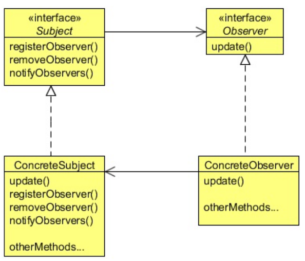
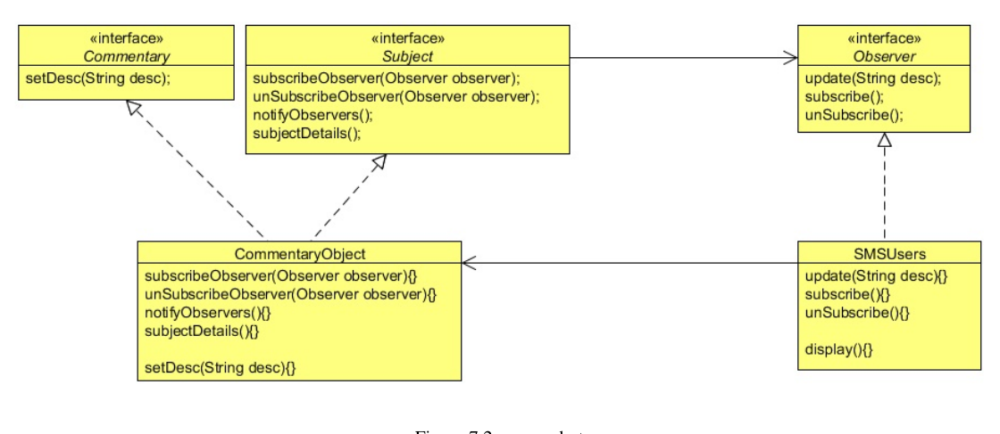

Sports Lobby is a fantastic sports site for sport lovers. They cover almost all kinds of sports and provide the latest news,
information, matches scheduled dates, information about a particular player or a team. Now, they are planning to provide live
commentary or scores of matches as an SMS service, but only for their premium users. Their aim is to SMS the live score, match
situation, and important events after short intervals. As a user, you need to subscribe to the package and when there is a live
match you will get an SMS to the live commentary. The site also provides an option to unsubscribe from the package whenever
you want to.
As a developer, the Sport Lobby asked you to provide this new feature for them. The reporters of the Sport Lobby will sit in
the commentary box in the match, and they will update live commentary to a commentary object. As a developer your job is to
provide the commentary to the registered users by fetching it from the commentary object when it’s available. When there is an
update, the system should update the subscribed users by sending them the SMS.
This situation clearly shows one-to-many mapping between the match and the users, as there could be many users to subscribe to
a single match. The Observer Design Pattern is best suited to this situation, let’s see about this pattern and then create the feature
for Sport Lobby.
1- What is the Observer Pattern:
There are four participants in the Observer pattern:
• Subject, which is used to register observers. Objects use this interface to register as observers and also to remove themselves
from being observers.
• Observer, defines an updating interface for objects that should be notified of changes in a subject. All observers need to
implement the Observer interface. This interface has a method update(), which gets called when the Subject’s state changes.
• ConcreteSubject, stores the state of interest to ConcreteObserver objects. It sends a notification to its observers when its state
changes. A concrete subject always implements the Subject interface. The notifyObservers() method is used to update
all the current observers whenever the state changes.
• ConcreateObserver, maintains a reference to a ConcreteSubject object and implements the Observer interface. Each observer
registers with a concrete subject to receive updates.

2- Implementing Observer Pattern:
