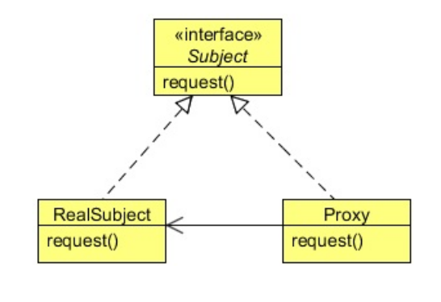

Concepts clés du modèle de conception de méthode proxy en Java
**Interface du sujet (ou classe abstraite)** : il s'agit de l'interface commune ou de la classe abstraite que le RealSubject (l'objet réel) et le Proxy implémentent. Elle définit les opérations auxquelles le Proxy contrôlera l'accès.
**RealSubject** : il s'agit de l'objet réel que représente le proxy. Il implémente l'interface Subject. Il fournit l'implémentation réelle des opérations déclarées dans l'interface Subject.
**Proxy** : la classe Proxy implémente également l'interface Subject. Elle contient une référence au RealSubject et contrôle l'accès à celui-ci. 
Le Proxy peut fournir des fonctionnalités supplémentaires avant ou après l'affectation de l'opération au RealSubject.
Client : le code client interagit avec le proxy comme s'il s'agissait d'un objet réel. Le client ne sait pas s'il utilise l'objet réel ou un proxy.
